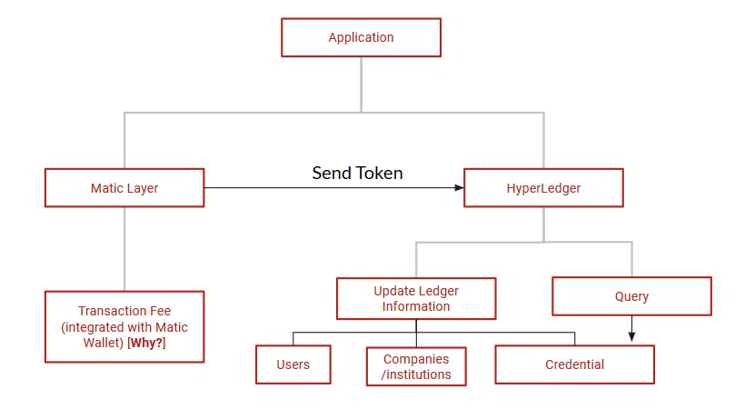

# “One out of every Six candidates were found to lie on their resume" #

# ResuMatic #

## A Blockchain-based decentralized app that provides a solution for verified credentials on person resume. ##

## Problems  ##

* **Fake Resume**
* **Long Verification process**
* **High manual labour and costs**

## Fake Resume ##

## Solution Proposal  ##

* **We propose to build a dApp that verifies users’ credentials and stores the evidence as immutable transaction records on the blockchain ledger i.e. Once Verified, Always Verified!**
* **In simple terms, we provide authentication and verification to ones resume.**

## Incentives for people to user our dapp ##

### For users: ###

* ** Authentic Verified  Resumes **
* ** Unlike facebook or LinkedIn , Data Privacy is maintained  **
* ** Better job prospects **

### For Companies/Organisation: ###

* **  Better Potential Candidates **
* **  Lower Hiring Costs ** 
* ** Improves Reputation of Institutes ** 