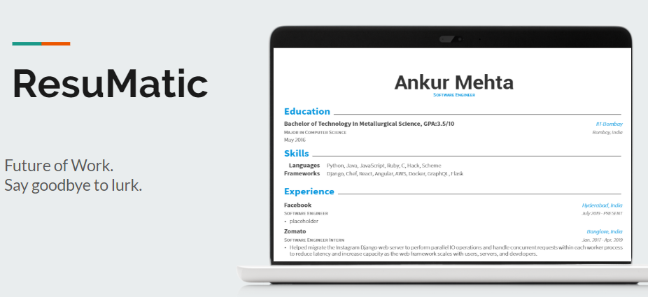

# ResuMatic #

## Problems  ##

* **Fake Resume and Personal Branding**
* **Long Verification process**
* **High manual labour and costs**

## Solution Proposal  ##

* **We propose to build a dApp that verifies users’ credentials and stores the evidence as immutable transaction records on the blockchain ledger.**
* **In simple terms, we provide authentication and verification to ones resume.**

## View Concept here  ##

**https://docs.google.com/presentation/d/1xuRrYsP10PB7IkScKBc_2iVKIsIh1ADBVMHFLi3cQJA/edit?usp=sharing**
